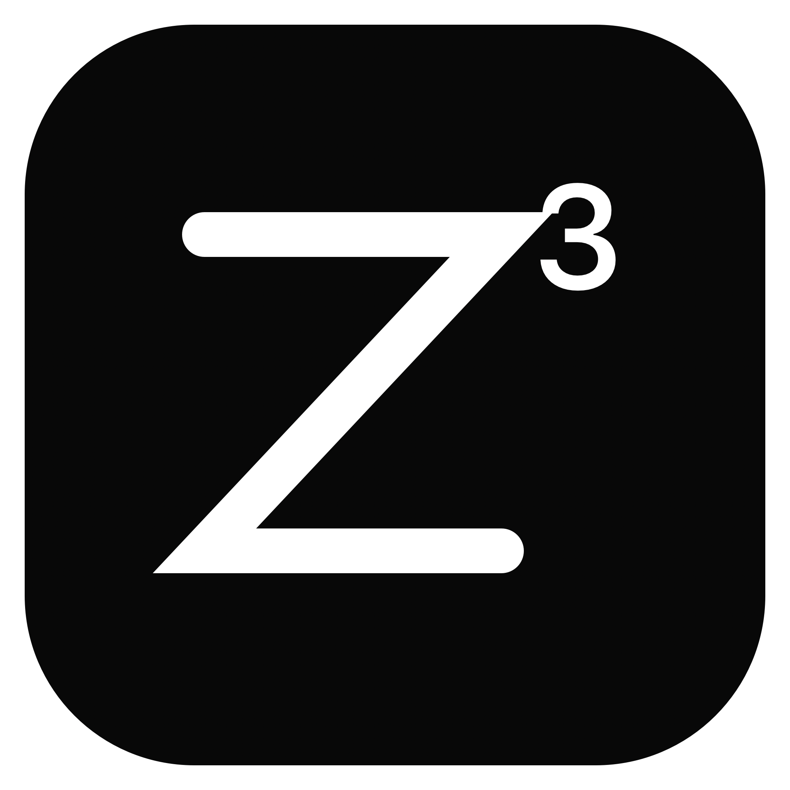

<p align="center">
  
</p>

<h1 align="center">donts3p</h1>

<p align="center">
  A tiny native macOS menu-bar app that keeps your Mac awake while the display is off.
</p>

<p align="center">
  <a href="https://github.com/jaymunsh/donts3p/releases/latest">Download</a> ·
  <a href="#installation">Installation</a> ·
  <a href="#how-it-works">How it works</a>
</p>

## Overview

donts3p prevents **user-idle system sleep** so terminals, local servers, downloads, and AI agents can continue running. It stays out of the Dock and exposes a compact `Z³` status icon in the menu bar.

- Native Swift app with no third-party runtime
- Apple Silicon and macOS 14 or later
- One-click sleep-prevention toggle
- Display sleep and screen lock remain available
- Recovers the enabled state after login or an unexpected app exit
- No global power-setting changes and no privileged helper

## Installation

### Download the release

1. Download `donts3p-macos-arm64.zip` from [Releases](https://github.com/jaymunsh/donts3p/releases/latest).
2. Extract the archive.
3. Move `donts3p.app` into `/Applications`.
4. In Finder, Control-click `donts3p.app` and select **Open**.

The release is ad-hoc signed, so macOS may initially identify it as being from an unidentified developer. Approve only this app through **System Settings → Privacy & Security** if prompted. Never disable Gatekeeper globally.

### Build from source

Requirements: Apple Silicon Mac, macOS 14+, Xcode Command Line Tools, and Swift 5.10+.

```sh
git clone https://github.com/jaymunsh/donts3p.git
cd donts3p
Scripts/package-adhoc.sh
```

The app is generated at `build/donts3p.app`, and the distributable archive at `release/donts3p-macos-arm64.zip`.

## Usage

Open donts3p and use its menu-bar icon:

- Circled check: sleep prevention is active and recently verified.
- Circled X: inactive, stale, degraded, or failed.
- **Turn On / Turn Off**: change the desired state.
- The menu shows active duration, power source, battery level, assertion health, and login-recovery status.
- **Quit**: stop the menu-bar app.

The display may turn off and the screen may lock while background work continues.

## How it works

donts3p holds a macOS power-management assertion that blocks user-idle system sleep. An unprivileged per-user recovery supervisor restores an enabled session after login or an unexpected app exit without owning assertions or changing system-wide settings.

## Important limitation

**Closed-lid operation is not supported.** Closing a MacBook lid can still put the machine to sleep. Keep the lid open, or use a macOS-supported clamshell setup with the required external display, power, and input devices.

The app also cannot prevent shutdown, restart, updates, thermal protection, or battery exhaustion.

## Uninstall

Quit donts3p, then run:

```sh
Scripts/uninstall-user.sh
rm -rf /Applications/donts3p.app
```

## Release verification

```sh
Scripts/verify-release.sh release/donts3p-macos-arm64.zip
```

The package script verifies the app bundle, embedded recovery agent, signatures, and extracted archive before reporting success.

## License

MIT © jaymunsh. See [LICENSE](LICENSE).
